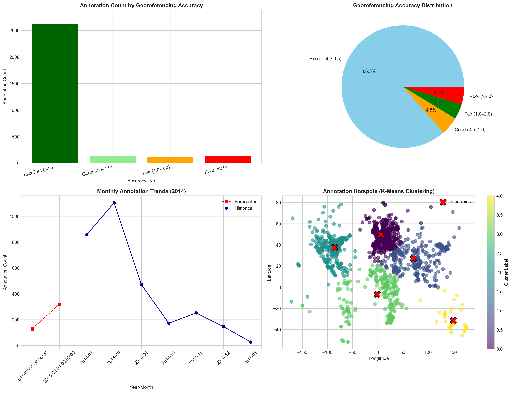

# 🗺️ Flickr Geodata Analytics Dashboard
> *What happens when 3,000 historical maps meet machine learning?*

An end-to-end data science project analyzing crowdsourced georeferencing data from the British Library's Flickr collection — from raw messy coordinates to an interactive dashboard with clustering, forecasting, and geospatial visualization.

---

## 🤔 The Problem

The British Library has thousands of historical maps digitized and georeferenced by volunteers online. But how accurate is this crowdsourced data? Where are the maps concentrated? Is volunteer activity growing or declining?

We built a pipeline to answer all of this — and visualize it interactively.

---

## 🔍 What We Found

- **90%+ of crowdsourced maps are high quality** — volunteers are surprisingly precise
- **August 2014 was the peak** of annotation activity; our ARIMA model predicts a coming lull
- **Geographic bias is real** — K-Means clustering reveals annotations cluster heavily around Western Europe, centered on London (the British Library's home)
- **The data tells a story about who participates in digitization** — and who doesn't

---

## 📊 Dashboard

Four interactive visualizations, each answering a different question:

| # | Chart | Question Answered |
|---|---|---|
| 1 | Bar Chart | How accurate is the georeferencing? |
| 2 | Pie Chart | What proportion of data is actually usable? |
| 3 | Line Chart + ARIMA | When are volunteers most active — and what comes next? |
| 4 | Scatter Map + K-Means | Where in the world are these maps concentrated? |

---

## 🛠️ Tech Stack

```
Data Cleaning     →  Pandas, NumPy, Regex, Unicodedata
Machine Learning  →  Scikit-learn (K-Means), Statsmodels (ARIMA)
Geospatial        →  Coordinate parsing, WKT polygon conversion
Visualization     →  Plotly Express, Plotly Graph Objects
Dashboard         →  Python Dash
```

---

## 📁 Project Structure

```
├── Project_4.ipynb                        # Full pipeline: clean → analyze → visualize
├── flickr_geodata.csv                     # Raw data (3,137 records)
├── flickr_geodata_final.csv               # Cleaned data (3,031 records, 22 columns)
├── 1_group_query_top10_collections.csv    # Accuracy tier counts
├── 2_transformation_rms_quality.csv       # Quality distribution
├── 3_temporal_monthly_trends.csv          # Monthly trends + ARIMA forecast
├── 4_spatial_clustering_points.csv        # K-Means cluster assignments
├── 4_spatial_clustering_centroids.csv     # Cluster centroids
├── indicator_descriptions.txt            # Dashboard markdown descriptions
└── validation_plots.png                   # Static overview of all 4 charts
```

---

## 🚀 Run It Yourself

```bash
pip install dash plotly pandas numpy scikit-learn statsmodels
```

Then open `Project_4.ipynb`, run all cells, and visit:
```
http://127.0.0.1:8050/
```

---

## 📸 Preview



---

## 👥 Team

| Member | Role |
|---|---|
| **Yuchun Wang** | Visualization & Dashboard |
| Elise Fouillet | Data Cleaning |
| Jinxin Zhou | Algorithm Analysis |
